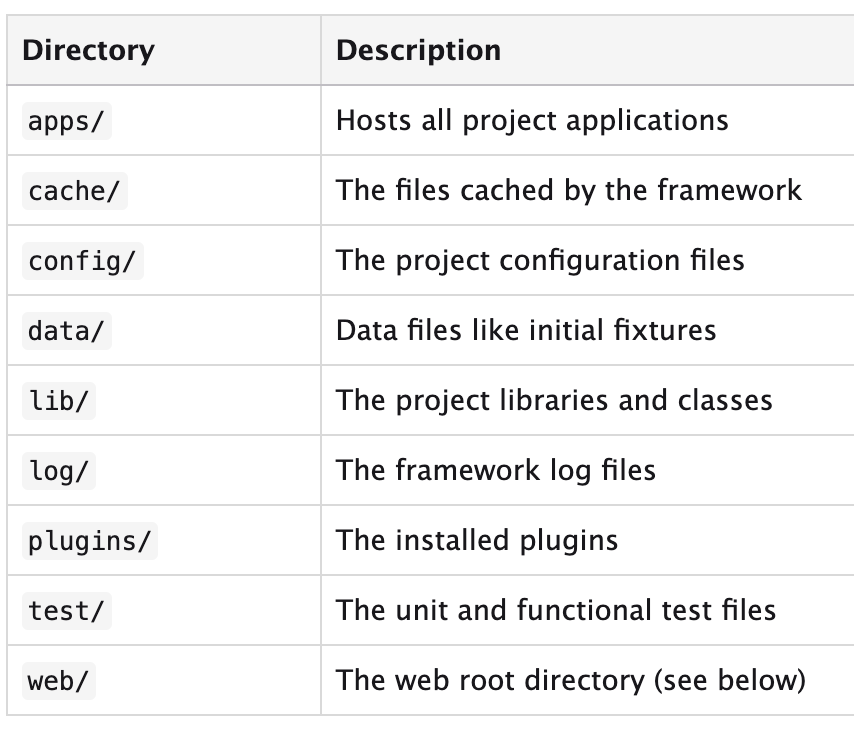
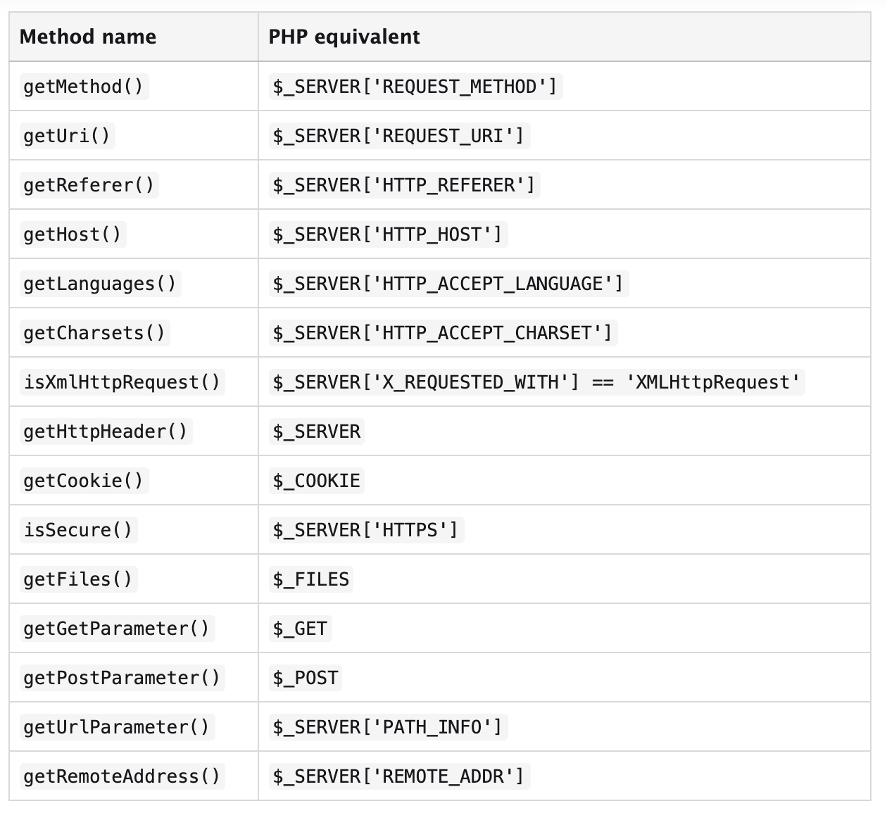

# Symfony 1.x project build

#### Project Build Command

`php SYMFONY_ROOT generate:project PROJECT_NAME`

#### project dir description

### App Build Command

`php SYMFONY_ROOT_LOC generate:app APP_NAME`

### Request Methods

